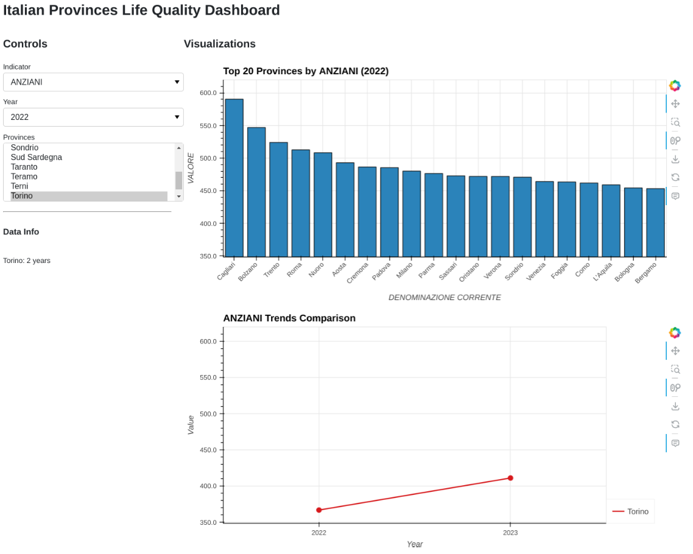

# Italian Provinces Quality of Life Dashboard

## Overview
This interactive dashboard visualizes the "Qualità della Vita 2024" (Quality of Life 2024) dataset from Il Sole 24 ORE, which ranks Italian provinces based on various quality of life indicators. The dashboard provides an intuitive interface for exploring and comparing different quality of life metrics across Italian provinces.



## Data Source
The data is sourced from Il Sole 24 ORE's annual survey ([GitHub Repository](https://github.com/IlSole24ORE)), representing the 35th edition of their traditional annual ranking that evaluates Italian provinces based on various quality of life indicators.

### Dataset Details
- **File**: `20241216_QDV2024_001.csv`
- **Format**: CSV (Comma-separated values)
- **Encoding**: UTF-8
- **License**: CC-BY-NC-4.0 (Creative Commons Attribution-NonCommercial 4.0 International)

### Data Structure
The dataset contains the following fields:
- NOME PROVINCIA (ISTAT): Extended name of the province
- CODICE NUTS 3 2021: NUTS 3 code
- CODICE PROVINCIA ISTAT (STORICO): Historical ISTAT province code
- DENOMINAZIONE CORRENTE: Common name of the province
- VALORE: Measured value of the indicator
- INDICATORE: Indicator name
- UNITA' DI MISURA: Unit of measurement
- RIFERIMENTO TEMPORALE: Time reference
- FONTE ORIGINALE: Original data source

## Features

### 1. Interactive Visualizations
- **Bar Chart**: Shows top 20 provinces for selected indicators
- **Time Series**: Enables comparison of multiple provinces over time
- **Dynamic Updates**: Real-time updates based on user selections

### 2. Selection Controls
- Indicator selector
- Year selector (updates based on available data)
- Multi-province selector for comparison

### 3. Data Information
- Shows available years for each selected province
- Provides context about the data being displayed

## Technical Implementation

### Dependencies
```python
pip install pandas holoviews panel bokeh
```

### Key Components

#### 1. Dashboard Class
```python
class ItalianProvincesDashboard:
    def __init__(self, data)
    def create_bar_chart(self, indicator, year)
    def create_time_series(self, indicator, provinces)
    def create_dashboard(self)
```

#### 2. Visualization Features
- Dynamic axis scaling
- Color-coded province comparisons
- Interactive hover tools
- Responsive layout

## Usage Instructions

### Running the Dashboard
1. Install required dependencies
2. Save the dashboard code to a Python file (e.g., `dashboard.py`)
3. Run the script:
```python
python dashboard.py
```
4. Access the dashboard at `http://localhost:5006/`

### Using the Dashboard
1. **Select an Indicator**: Choose from the dropdown list of available indicators
2. **Choose a Year**: Select a specific year for the bar chart visualization
3. **Compare Provinces**: Select multiple provinces from the list to compare trends
4. **Interact with Visualizations**:
   - Hover over data points for detailed information
   - Use the legend to toggle province visibility
   - Explore different time periods and indicators

## Data Updates
The dashboard uses the latest available data from Il Sole 24 ORE's Quality of Life survey. The current version uses data from the 2024 edition.

## License and Attribution
This project uses data from Il Sole 24 ORE under the CC-BY-NC-4.0 license. When using or sharing this dashboard or its outputs, please provide appropriate attribution to:
- Il Sole 24 ORE as the original data source
- The CC-BY-NC-4.0 license terms

## Contact and Support
For questions about the data source, contact Il Sole 24 ORE at:
qualitadellavita@ilsole24ore.com

## Acknowledgments
- Data provided by Il Sole 24 ORE
- Thanks to onData association for their data publication suggestions
